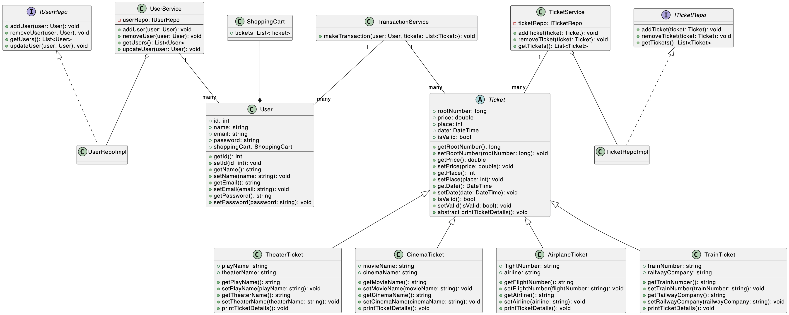

# Architecture
Урок 4. Компоненты. Принципы связности и сочетаемости компонентов
По UML диаграмме написать сервис по продаже билетов,и её применить(метро,автобус,театр,самолёт и т.д.) так же прикрепить обновлённую диаграмму

